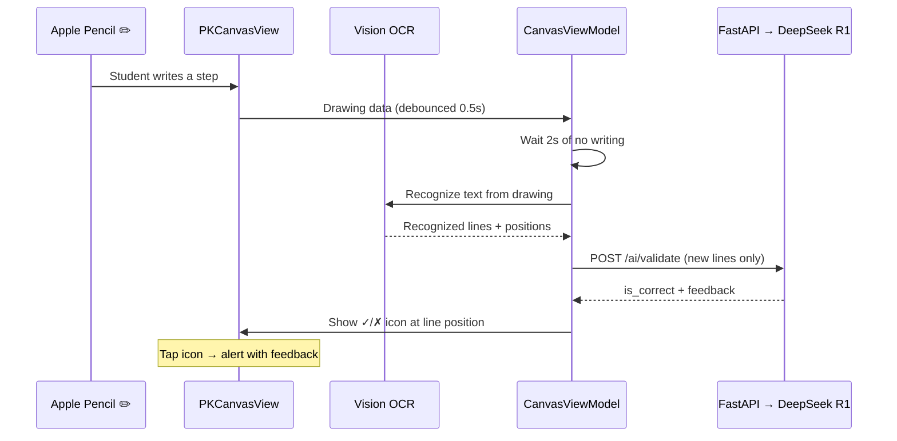

# Auto-Validation Changes

## What Changed

### Core Concept
Steps are now **validated automatically** as the student writes. No manual "validate" button needed.

### Flow

### Files Changed

| File | Change |
|------|--------|
| **NEW** [TextRecognitionService.swift](file:///Users/ayushsharma/IOS/NextStep/NextStep/Services/TextRecognitionService.swift) | Vision OCR — recognizes handwritten text from PKDrawing, returns lines with canvas-coordinate bounding boxes |
| **NEW** [ValidatedStep.swift](file:///Users/ayushsharma/IOS/NextStep/NextStep/Models/ValidatedStep.swift) | Model tracking each step's text, position, correctness, and feedback |
| [PencilKitView.swift](file:///Users/ayushsharma/IOS/NextStep/NextStep/Views/Components/PencilKitView.swift) | Adds validation icons as UIKit subviews on the canvas. `drawingPolicy = .pencilOnly` so finger taps work on icons. Spring animation on result appearance. |
| [CanvasViewModel.swift](file:///Users/ayushsharma/IOS/NextStep/NextStep/ViewModels/CanvasViewModel.swift) | `updateSolutionData()` triggers debounced OCR → validation pipeline. Tracks `validatedSteps` and `validatedTexts` to avoid re-validating. |
| [CanvasView.swift](file:///Users/ayushsharma/IOS/NextStep/NextStep/Views/Canvas/CanvasView.swift) | Shows live ✓/✗/⏳ count badges in header. Tapping an icon shows an alert with AI feedback. |
| [AIPanelView.swift](file:///Users/ayushsharma/IOS/NextStep/NextStep/Views/AIPanel/AIPanelView.swift) | **Simplified** — only Hint, Next Step, and Full Solution buttons. No manual validation. |

### Key Design Decisions

- **`drawingPolicy = .pencilOnly`** — Apple Pencil draws, finger taps icons / scrolls. This is the standard iPad UX.
- **2-second debounce** before OCR — prevents spamming the API while the student is mid-stroke.
- **Deduplication** — each recognized text is only validated once (tracked in `validatedTexts` set).
- **Icons as UIKit subviews** — positioned directly on the PKCanvasView so they scroll naturally with the canvas content.
- **Spring animation** — validation icons pop in with a spring effect when results arrive.
