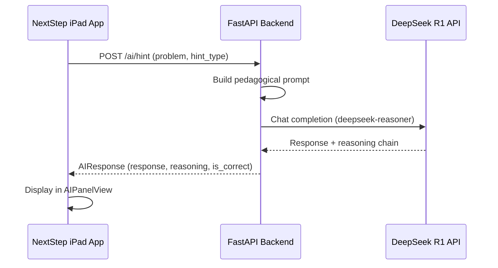

# NextStep Backend + Frontend Integration — Setup Complete

## What Was Done

### 🐍 Backend (Poetry + FastAPI + DeepSeek R1)

Created a full Python backend in `Backend/` with Poetry:

| File | Purpose |
|------|---------|
| [pyproject.toml](file:///Users/ayushsharma/IOS/NextStep/Backend/pyproject.toml) | Poetry config with FastAPI, OpenAI, Pydantic, uvicorn |
| [app/main.py](file:///Users/ayushsharma/IOS/NextStep/Backend/app/main.py) | FastAPI app entry point with CORS for iOS |
| [app/config.py](file:///Users/ayushsharma/IOS/NextStep/Backend/app/config.py) | Loads DeepSeek API key from `.env` |
| [app/routes.py](file:///Users/ayushsharma/IOS/NextStep/Backend/app/routes.py) | 4 endpoints: health, hint, validate, solution |
| [app/deepseek_client.py](file:///Users/ayushsharma/IOS/NextStep/Backend/app/deepseek_client.py) | Async DeepSeek R1 client (OpenAI-compatible) |
| [app/prompts.py](file:///Users/ayushsharma/IOS/NextStep/Backend/app/prompts.py) | Pedagogical prompt builder for all request types |
| [app/models.py](file:///Users/ayushsharma/IOS/NextStep/Backend/app/models.py) | Pydantic request/response schemas |

### API Endpoints

```
GET  /ai/health    → {"status": "ok", "model": "deepseek-reasoner"}
POST /ai/hint      → Hint, Next Step, or Reflective Question
POST /ai/validate  → Check a single solution step (returns is_correct + feedback)
POST /ai/solution  → Full step-by-step solution
```

### 📱 Swift Frontend Changes

| File | What Changed |
|------|-------------|
| [AIService.swift](file:///Users/ayushsharma/IOS/NextStep/NextStep/Services/AIService.swift) | **Rewritten** — now makes real HTTP calls to backend instead of returning hardcoded strings |
| [CanvasViewModel.swift](file:///Users/ayushsharma/IOS/NextStep/NextStep/ViewModels/CanvasViewModel.swift) | Added `validateStep()`, `requestFullSolution()`, conversation history tracking |
| [AIPanelView.swift](file:///Users/ayushsharma/IOS/NextStep/NextStep/Views/AIPanel/AIPanelView.swift) | Added validation text field, full solution button, DeepSeek R1 branding |
| [Info.plist](file:///Users/ayushsharma/IOS/NextStep/NextStep/Info.plist) | Added `NSAppTransportSecurity` for local HTTP |

## How to Run

### 1. Start the Backend
```bash
cd /Users/ayushsharma/IOS/NextStep/Backend
poetry run uvicorn app.main:app --reload --host 0.0.0.0 --port 8000
```

### 2. Run the iOS App
Open `NextStep.xcodeproj` in Xcode and run on Simulator (localhost works automatically).

> [!IMPORTANT]
> For a **real device**, change `AIService.baseURL` in `AIService.swift` to your Mac's local IP (e.g., `http://192.168.1.x:8000`).

## ✅ Tested & Working

Both endpoints were tested with curl and returned real DeepSeek R1 responses:

- **Hint**: Returned a pedagogically-sound hint with reasoning chain
- **Validate**: Correctly identified `x = (-5 ± √(25+96)) / 4` as correct for `2x² + 5x − 12 = 0`, with positive feedback

## Architecture Flow


